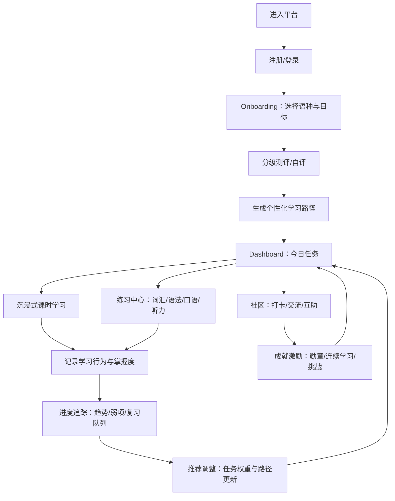

## 1. 产品概述
打造面向英语、日语、韩语等主流语种的沉浸式在线语言学习平台，覆盖“分级课程 + 互动练习 + 进度追踪 + 社区激励 + 个性化推荐”的闭环学习体验。
- 目标用户：自学者、备考用户、希望提升听说读写综合能力的长期学习者
- 核心价值：用结构化课程体系降低入门门槛，用高频互动练习与激励机制提升留存与学习成效

## 2. 核心功能

### 2.1 用户角色（如适用）
| 角色 | 注册方式 | 核心权限 |
|------|----------|----------|
| 学习者 | 邮箱/用户名注册 | 学习课程、做练习、查看进度、参与社区、获得成就 |
| 管理员/版主 | 后台创建 | 课程内容管理、社区内容治理、运营配置（成就/活动） |

### 2.2 功能模块（按页面组织）
1. **着陆页/课程导览**：平台介绍、语种选择、分级体系说明、热门课程入口
2. **注册登录**：注册、登录、找回密码、会话管理
3. **学习引导（Onboarding）**：语种选择、学习目标、每周时间、基础测评/自评分级、生成学习路径
4. **学习主页（Dashboard）**：今日任务、连续学习、推荐课程/练习、学习时间与正确率概览
5. **分级课程体系**：语种 → 等级（如 A1/A2/B1…）→ 单元 → 课时；支持筛选与学习计划
6. **沉浸式课时播放器**：多模态输入（字幕/词汇/语法点/跟读）、场景化对话、重点词句高亮
7. **互动式学习模块（练习中心）**
   - 单词记忆：SRS 间隔重复、例句/同义反义、听音辨词
   - 语法练习：选择/填空/改错、规则解释与错题本
   - 口语跟读：句子跟读、发音对比（文本匹配/节奏提示）、录音回放
   - 听力训练：精听/泛听、逐句回放、关键词提示与答题
8. **学习进度追踪**：课程完成度、能力雷达（词汇/语法/听力/口语）、错题与复习计划、学习日历
9. **个性化学习路径推荐**：基于分级结果、兴趣主题、历史表现（正确率/时长/薄弱项）动态调整任务
10. **社区交流**：话题/帖子/评论/点赞/收藏、学习打卡、纠错与互助
11. **成就激励系统**：勋章、等级、连续学习奖励、任务挑战、排行榜（可选）
12. **个人中心与设置**：资料、目标与提醒、隐私设置、学习数据导出（可选）

### 2.3 页面明细
| 页面名称 | 模块名称 | 功能描述 |
|----------|----------|----------|
| 着陆页 | 语种与分级介绍 | 展示语种入口、分级体系、学习方法；引导注册/登录 |
| 注册登录 | 注册/登录/找回 | 邮箱/用户名注册、密码登录、找回密码、登录态保持 |
| Onboarding | 测评与目标 | 选择语种与学习目标、分级自测/测验，生成初始学习路径 |
| Dashboard | 今日任务 | 课程/练习任务清单、连续学习、弱项提示、快速开始 |
| 课程目录 | 语种/等级/单元 | 分级导航、课程卡片、进度显示、收藏与继续学习 |
| 课时播放器 | 场景化学习 | 对话/文章内容、字幕切换、词汇/语法点抽屉、重点标注 |
| 课时播放器 | 跟读与听力 | 逐句播放、变速、A/B 对照、跟读录音与回放、自动对照文本 |
| 练习中心 | 单词记忆 | SRS 复习队列、听写/辨音、例句与讲解、掌握度记录 |
| 练习中心 | 语法练习 | 题库练习、即时反馈、规则解释、错题本与再练 |
| 练习中心 | 口语跟读 | 句子卡片、录音按钮、相似度提示（文本/节奏）、历史记录 |
| 练习中心 | 听力训练 | 题型选择、逐句精听、答案解析、错题重听 |
| 进度追踪 | 数据面板 | 完成度、正确率、学习时长、能力雷达、周/月趋势 |
| 进度追踪 | 复习与错题 | 错题集合、复习队列、复习计划（今日/本周） |
| 推荐路径 | 学习路径 | 生成/调整学习路线、任务优先级、替换建议与理由 |
| 社区 | 话题流 | 帖子列表、筛选（语种/等级/主题）、发帖、评论互动 |
| 成就 | 勋章与挑战 | 勋章墙、连续学习、挑战任务、排行榜（可选开关） |
| 个人中心 | 资料与设置 | 头像昵称、目标与提醒、隐私、账号安全（修改密码/退出） |
| 管理后台（可选） | 内容管理 | 课程/课时/题目维护、审核、运营配置 |

## 3. 核心流程

### 3.1 主要用户流程（自然语言）
- 用户注册/登录后进入 Onboarding，选择语种与学习目标，完成分级测评或自评
- 系统生成个性化学习路径与“今日任务”，用户从 Dashboard 一键进入“课时学习”或“练习中心”
- 学习过程中完成单词/语法/跟读/听力练习，系统记录正确率、时长与掌握度，形成复习队列
- 用户可在进度页查看趋势与弱项；系统根据表现动态调整推荐路径与任务权重
- 用户通过社区打卡、交流与互助获得成就与激励，提升连续学习与留存

### 3.2 流程图（Mermaid）

## 4. 用户界面设计

### 4.1 设计风格
- 视觉定位：沉浸式“语言实验室”体验，强对比、聚焦内容与练习反馈
- 主色：深色底（近黑/深蓝），强调色根据语种可切换（英语=青绿、日语=樱红、韩语=靛紫）
- 字体：优先选择覆盖多语种的字体组合（标题更具性格，正文更易读），中日韩一致风格与字重体系
- 布局：桌面优先，顶部导航 + 左侧学习区/右侧辅助抽屉（词汇/语法/笔记/进度）
- 组件：按钮圆角、可触达的练习卡片、反馈明确的状态（正确/错误/部分正确）
- 动效：学习内容进入的分段呈现、练习反馈的微动效、连续学习与成就的仪式感动画

### 4.2 页面设计概览
| 页面名称 | 模块名称 | UI 元素 |
|----------|----------|---------|
| Dashboard | 今日任务 | 任务卡片、连续学习条、弱项提示、快捷入口、进度环 |
| 课时播放器 | 沉浸式阅读/对话 | 主内容区、字幕切换、重点高亮、右侧抽屉（词汇/语法/笔记） |
| 练习中心 | 练习卡片体系 | 题目卡片、即时反馈面板、解析展开、错题标记、复习队列 |
| 进度追踪 | 数据可视化 | 雷达图、趋势图、学习日历、能力分解条、复习列表 |
| 社区 | 话题流 | 帖子卡片、标签/筛选、编辑器、评论区、点赞收藏 |
| 成就 | 勋章墙 | 勋章栅格、进度条、挑战列表、排行榜（可选） |

### 4.3 响应式
- 桌面优先：完整的学习区 + 辅助抽屉并排呈现
- 移动适配：抽屉改为底部上拉面板；课时播放器重点内容优先；练习按钮更大更易触达
- 触控优化：滑动切题、长按收藏/加入复习、音频播放手势优化

