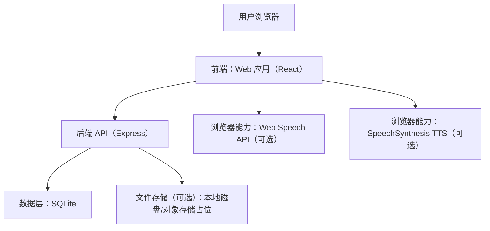
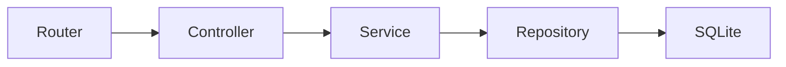
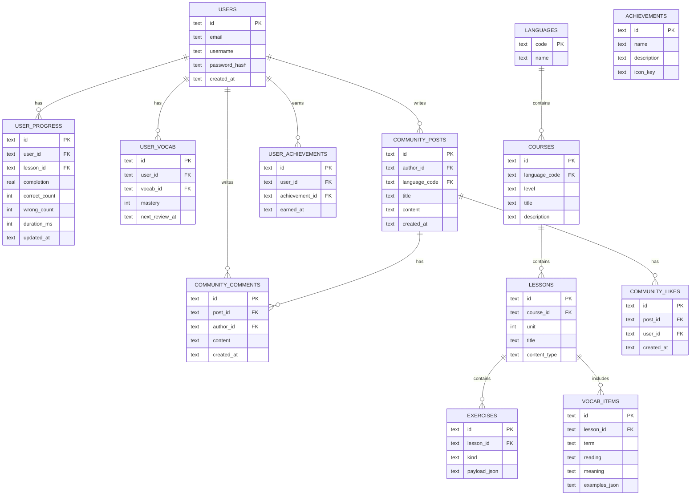

## 1. 架构设计



说明：
- 前端负责沉浸式学习体验、练习交互、音频播放与跟读录音等
- 后端负责账号体系、课程与练习内容分发、进度与成就计算、社区数据读写、推荐策略输出
- 数据库优先选 SQLite 作为轻量部署方案，后续可平滑迁移到 PostgreSQL/MySQL
- 口语跟读/听力的“识别与朗读”优先使用浏览器原生能力（避免引入外部服务）；更强评测可后续接入第三方语音服务

## 2. 技术选型说明
- 前端：React@18 + TypeScript + Vite + tailwindcss@3
- 状态与请求：React Query（如已引入）或轻量自研请求层 + Context/Store（按实现阶段选择）
- 路由：React Router（如已引入）
- 后端：Node.js + Express@4
- 认证：JWT（Access Token）+ HttpOnly Cookie/Authorization Header（二选一，按安全策略确定）
- 数据库：SQLite（开发与自托管部署）；SQL 直连或轻量 ORM（优先直连以降低复杂度）
- 富文本：社区发帖支持基础 Markdown（可选）

## 3. 路由定义（前端）
| 路由 | 用途 |
|------|------|
| / | 着陆页/课程导览 |
| /auth/login | 登录 |
| /auth/register | 注册 |
| /onboarding | 语种/目标/分级测评，生成学习路径 |
| /dashboard | 学习主页（今日任务、推荐、概览） |
| /courses | 分级课程目录（筛选：语种/等级/主题） |
| /courses/:courseId | 课程详情（单元/课时列表、继续学习） |
| /lessons/:lessonId | 沉浸式课时播放器（内容+练习入口） |
| /practice | 练习中心总览 |
| /practice/vocab | 单词记忆（SRS） |
| /practice/grammar | 语法练习 |
| /practice/speaking | 口语跟读 |
| /practice/listening | 听力训练 |
| /progress | 进度追踪（趋势、能力、复习、错题） |
| /community | 社区话题流 |
| /community/:postId | 帖子详情与评论 |
| /achievements | 成就与激励系统 |
| /profile | 个人中心与设置 |
| /admin（可选） | 内容管理与社区治理 |

## 4. API 定义（后端）

### 4.1 认证与用户
```ts
export type RegisterReq = { email: string; username: string; password: string };
export type LoginReq = { identifier: string; password: string };

export type AuthResp = {
  user: { id: string; email: string; username: string; createdAt: string };
  accessToken: string;
};
```

- `POST /api/auth/register`：注册
- `POST /api/auth/login`：登录
- `POST /api/auth/logout`：退出（如使用 Cookie）
- `GET /api/me`：获取当前用户

### 4.2 课程与课时
```ts
export type LanguageCode = "en" | "ja" | "ko";

export type Course = {
  id: string;
  language: LanguageCode;
  level: string;
  title: string;
  description: string;
  coverUrl?: string;
};

export type Lesson = {
  id: string;
  courseId: string;
  unit: number;
  title: string;
  contentType: "dialogue" | "article";
};
```

- `GET /api/languages`：语种列表
- `GET /api/courses?language=en&level=A1`：课程列表（筛选）
- `GET /api/courses/:courseId`：课程详情
- `GET /api/lessons/:lessonId`：课时详情（内容、词汇点、语法点、练习配置）

### 4.3 练习与学习数据
```ts
export type SubmitExerciseReq = {
  lessonId?: string;
  exerciseId: string;
  answer: unknown;
  durationMs: number;
};

export type SubmitExerciseResp = {
  correct: boolean;
  score?: number;
  feedback: string;
  nextReviewAt?: string;
};
```

- `POST /api/exercises/submit`：提交练习（词汇/语法/听力等）
- `POST /api/speaking/submit`（可选）：提交口语跟读结果（文本匹配/录音元数据）
- `GET /api/progress/overview`：学习概览（时长、正确率、连续学习）
- `GET /api/progress/review-queue`：SRS 复习队列
- `GET /api/progress/mistakes`：错题本

### 4.4 推荐路径
```ts
export type Recommendation = {
  id: string;
  type: "lesson" | "practice";
  title: string;
  reason: string;
  targetRoute: string;
  priority: number;
};
```

- `GET /api/recommendations/today`：今日任务与推荐
- `POST /api/recommendations/feedback`：用户反馈（喜欢/不喜欢/太简单/太难）

### 4.5 社区与成就
```ts
export type Post = {
  id: string;
  authorId: string;
  language: "en" | "ja" | "ko";
  title: string;
  content: string;
  createdAt: string;
  likeCount: number;
  commentCount: number;
};

export type Achievement = {
  id: string;
  name: string;
  description: string;
  iconKey: string;
};
```

- `GET /api/community/posts?language=ja`：帖子列表
- `POST /api/community/posts`：发帖
- `GET /api/community/posts/:postId`：帖子详情
- `POST /api/community/posts/:postId/comments`：评论
- `POST /api/community/posts/:postId/like`：点赞/取消
- `GET /api/achievements`：成就列表
- `GET /api/achievements/me`：我的成就与进度

## 5. 服务端架构图（Express）


## 6. 数据模型

### 6.1 数据模型定义（ER 图）


### 6.2 数据定义语言（DDL）
```sql
CREATE TABLE IF NOT EXISTS users (
  id TEXT PRIMARY KEY,
  email TEXT NOT NULL UNIQUE,
  username TEXT NOT NULL UNIQUE,
  password_hash TEXT NOT NULL,
  created_at TEXT NOT NULL
);

CREATE TABLE IF NOT EXISTS languages (
  code TEXT PRIMARY KEY,
  name TEXT NOT NULL
);

CREATE TABLE IF NOT EXISTS courses (
  id TEXT PRIMARY KEY,
  language_code TEXT NOT NULL REFERENCES languages(code),
  level TEXT NOT NULL,
  title TEXT NOT NULL,
  description TEXT NOT NULL
);

CREATE TABLE IF NOT EXISTS lessons (
  id TEXT PRIMARY KEY,
  course_id TEXT NOT NULL REFERENCES courses(id),
  unit INTEGER NOT NULL,
  title TEXT NOT NULL,
  content_type TEXT NOT NULL
);

CREATE TABLE IF NOT EXISTS exercises (
  id TEXT PRIMARY KEY,
  lesson_id TEXT NOT NULL REFERENCES lessons(id),
  kind TEXT NOT NULL,
  payload_json TEXT NOT NULL
);

CREATE TABLE IF NOT EXISTS vocab_items (
  id TEXT PRIMARY KEY,
  lesson_id TEXT NOT NULL REFERENCES lessons(id),
  term TEXT NOT NULL,
  reading TEXT,
  meaning TEXT NOT NULL,
  examples_json TEXT NOT NULL
);

CREATE TABLE IF NOT EXISTS user_progress (
  id TEXT PRIMARY KEY,
  user_id TEXT NOT NULL REFERENCES users(id),
  lesson_id TEXT NOT NULL REFERENCES lessons(id),
  completion REAL NOT NULL,
  correct_count INTEGER NOT NULL,
  wrong_count INTEGER NOT NULL,
  duration_ms INTEGER NOT NULL,
  updated_at TEXT NOT NULL,
  UNIQUE(user_id, lesson_id)
);

CREATE TABLE IF NOT EXISTS user_vocab (
  id TEXT PRIMARY KEY,
  user_id TEXT NOT NULL REFERENCES users(id),
  vocab_id TEXT NOT NULL REFERENCES vocab_items(id),
  mastery INTEGER NOT NULL,
  next_review_at TEXT,
  UNIQUE(user_id, vocab_id)
);

CREATE TABLE IF NOT EXISTS achievements (
  id TEXT PRIMARY KEY,
  name TEXT NOT NULL,
  description TEXT NOT NULL,
  icon_key TEXT NOT NULL
);

CREATE TABLE IF NOT EXISTS user_achievements (
  id TEXT PRIMARY KEY,
  user_id TEXT NOT NULL REFERENCES users(id),
  achievement_id TEXT NOT NULL REFERENCES achievements(id),
  earned_at TEXT NOT NULL,
  UNIQUE(user_id, achievement_id)
);

CREATE TABLE IF NOT EXISTS community_posts (
  id TEXT PRIMARY KEY,
  author_id TEXT NOT NULL REFERENCES users(id),
  language_code TEXT NOT NULL REFERENCES languages(code),
  title TEXT NOT NULL,
  content TEXT NOT NULL,
  created_at TEXT NOT NULL
);

CREATE TABLE IF NOT EXISTS community_comments (
  id TEXT PRIMARY KEY,
  post_id TEXT NOT NULL REFERENCES community_posts(id),
  author_id TEXT NOT NULL REFERENCES users(id),
  content TEXT NOT NULL,
  created_at TEXT NOT NULL
);

CREATE TABLE IF NOT EXISTS community_likes (
  id TEXT PRIMARY KEY,
  post_id TEXT NOT NULL REFERENCES community_posts(id),
  user_id TEXT NOT NULL REFERENCES users(id),
  created_at TEXT NOT NULL,
  UNIQUE(post_id, user_id)
);
```

