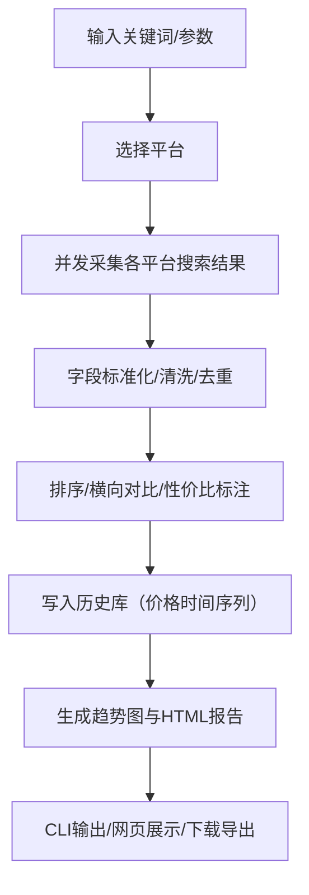

## 1. 产品概述
一个面向运营/采购/比价用户的“电商商品价格自动化采集与对比”工具：按关键词批量抓取多平台商品信息，清洗去重后做横向对比、性价比标注与价格趋势展示，并提供命令行与演示网页两种使用方式。
- 解决问题：人工比价耗时、信息分散、难以留存历史价格与形成可复用报告
- 产品价值：快速形成可分享的比价结果与趋势洞察，辅助选品/采购/投放决策

## 2. 核心功能

### 2.1 功能模块
1. **命令行工具（CLI）**：关键词采集、导出、生成报告、历史入库、趋势图输出
2. **采集引擎**：多平台采集适配（京东/淘宝/拼多多 + 可扩展）、并发、失败重试、节流
3. **数据处理**：字段标准化、清洗、去重、排序、横向对比、性价比推荐标注
4. **趋势与报告**：历史价格沉淀、趋势曲线、HTML 报告（表格 + 图表）
5. **演示网页**：输入关键词→触发采集→页面展示对比表/趋势图→下载结果

### 2.2 页面与模块
1. **演示首页**：关键词输入、平台选择、采集参数（条数/排序/导出格式）设置、启动按钮、运行日志区
2. **结果页（同页展示）**：对比表格（可筛选/排序/高亮推荐）、趋势图、下载按钮（CSV/JSON/HTML）

### 2.3 页面细节
| 页面名称 | 模块名称 | 功能说明 |
|---|---|---|
| 演示首页 | 关键词输入 | 支持关键词、可选类目/过滤条件（最低价、最低销量等） |
| 演示首页 | 平台选择 | 京东/淘宝/拼多多多选；支持“演示数据”模式 |
| 演示首页 | 参数区 | 每个平台抓取条数、并发数、超时、排序方式 |
| 演示首页 | 运行日志 | 展示抓取进度、错误提示、耗时 |
| 结果展示 | 对比表 | 字段：平台、商品名、价格、销量、店铺评分、链接、推荐标识 |
| 结果展示 | 趋势图 | 以“商品（或聚合最优）”为维度展示历史价格曲线 |
| 结果展示 | 导出区 | 下载 CSV/JSON、生成并下载 HTML 报告 |

## 3. 核心流程
用户在 CLI 或网页输入关键词 → 选择平台与参数 → 采集引擎并发抓取各平台搜索结果 → 统一字段映射与清洗去重 → 输出排序后的对比表 → 计算性价比标签 → 写入历史价格库 → 生成趋势图与 HTML 报告 → 用户下载或查看。

## 4. 用户界面设计

### 4.1 设计风格
- 视觉方向：数据密集型“编辑部/金融终端”风格，深色背景 + 高对比荧光点缀，强调表格可读性与图表清晰度
- 字体：标题使用具有编辑感的衬线展示字体，正文使用清晰的无衬线字体
- 布局：桌面优先，左侧输入与日志，右侧结果与图表；关键数字（最低价/推荐）强调色高亮

### 4.2 页面设计概览
| 页面名称 | 模块名称 | UI 元素 |
|---|---|---|
| 演示首页 | 输入区 | 大标题、关键词输入框、平台多选、参数折叠面板、启动按钮（加载态） |
| 演示首页 | 日志区 | 终端风格滚动区域、不同级别日志颜色 |
| 结果展示 | 对比表 | 粘性表头、可排序列、推荐行高亮、链接按钮 |
| 结果展示 | 趋势图 | 折线图、hover tooltip、图例、时间范围选择 |
| 结果展示 | 导出区 | 下载按钮组、报告生成按钮 |

### 4.3 响应式
桌面优先；移动端将输入区折叠为顶部抽屉，结果区保持单列滚动与必要字段折叠展示。
