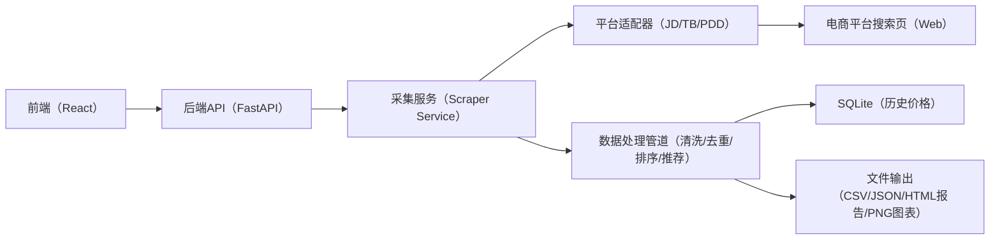
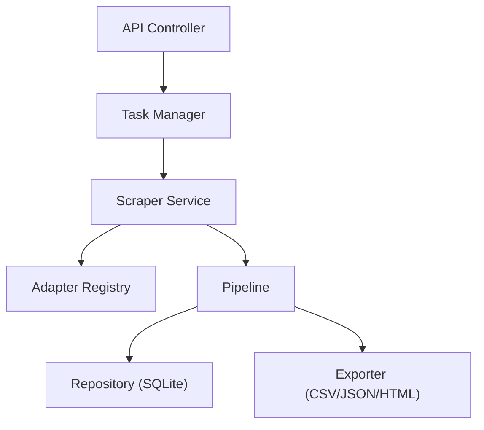
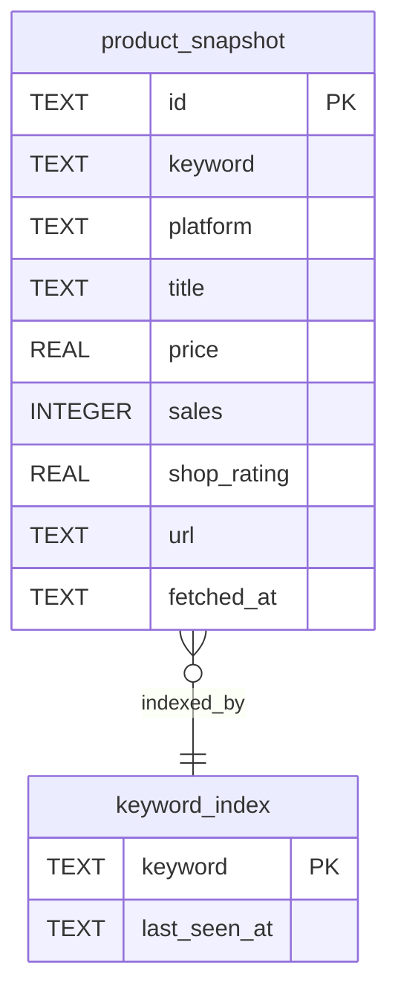

## 1. 架构设计



## 2. 技术说明
- 前端：React@18 + tailwindcss@3 + vite（桌面优先，数据终端风格）
- 后端：FastAPI + Uvicorn（提供运行采集、查询结果、下载导出等接口）
- CLI：Python（argparse/typer 二选一；以最少依赖优先）
- 采集：Playwright（headless）+ 适配器模式；支持“演示数据”离线模式
- 数据处理：pandas（若存在）优先；否则用标准库实现（确保可运行）
- 存储：SQLite（历史价格时间序列）；导出 CSV/JSON/HTML
- 可视化：前端使用 ECharts；后端生成图表使用 matplotlib（若存在）否则输出前端渲染所需的时间序列 JSON

## 3. 路由定义
| 路由 | 用途 |
|---|---|
| / | 演示页面（输入关键词、运行采集、展示结果） |
| /api/run | 启动一次采集任务（关键词、平台、条数等） |
| /api/task/{id} | 获取任务状态与日志 |
| /api/task/{id}/result | 获取清洗后的结果数据 |
| /api/task/{id}/export | 导出 CSV/JSON/HTML（按 query 参数选择格式） |
| /api/task/{id}/trend | 获取趋势时间序列数据（用于折线图） |

## 4. API 定义（后端存在）

```ts
export type Platform = "jd" | "taobao" | "pdd" | "demo";

export type RunRequest = {
  keyword: string;
  platforms: Platform[];
  limitPerPlatform?: number;
  concurrency?: number;
  demoMode?: boolean;
};

export type ProductItem = {
  id: string;
  platform: Platform;
  title: string;
  price: number;
  sales?: number;
  shopRating?: number;
  url: string;
  currency: "CNY";
  fetchedAt: string; // ISO
  score?: number; // 性价比评分（越大越好）
  tags?: string[]; // ["推荐", "低价", ...]
};

export type RunResponse = { taskId: string };

export type TaskStatus = {
  taskId: string;
  status: "queued" | "running" | "succeeded" | "failed";
  logs: { ts: string; level: "info" | "warn" | "error"; message: string }[];
  error?: string;
};

export type ResultResponse = {
  keyword: string;
  items: ProductItem[];
  summary: {
    total: number;
    lowestPrice?: number;
    recommendedIds: string[];
  };
};

export type TrendPoint = { ts: string; value: number };
export type TrendSeries = { productId: string; title: string; points: TrendPoint[] };
export type TrendResponse = { keyword: string; series: TrendSeries[] };
```

## 5. 服务端架构图



## 6. 数据模型

### 6.1 数据模型定义


### 6.2 数据定义语言
```sql
CREATE TABLE IF NOT EXISTS product_snapshot (
  id TEXT PRIMARY KEY,
  keyword TEXT NOT NULL,
  platform TEXT NOT NULL,
  title TEXT NOT NULL,
  price REAL NOT NULL,
  sales INTEGER,
  shop_rating REAL,
  url TEXT NOT NULL,
  fetched_at TEXT NOT NULL
);

CREATE INDEX IF NOT EXISTS idx_product_snapshot_keyword_time
  ON product_snapshot(keyword, fetched_at);

CREATE INDEX IF NOT EXISTS idx_product_snapshot_platform
  ON product_snapshot(platform);
```
